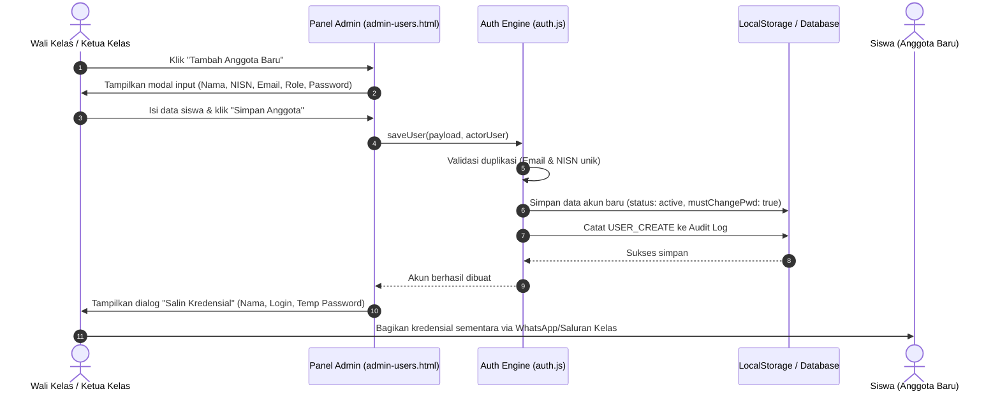
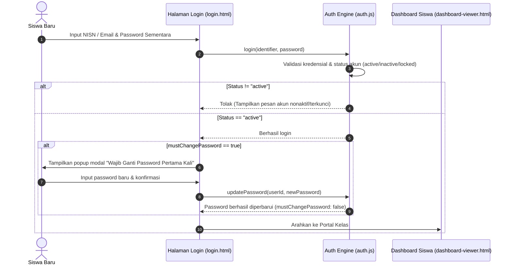
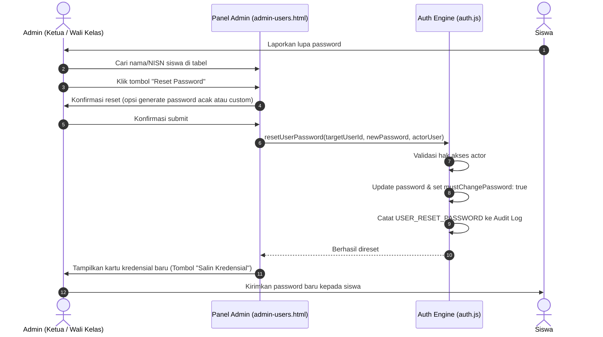
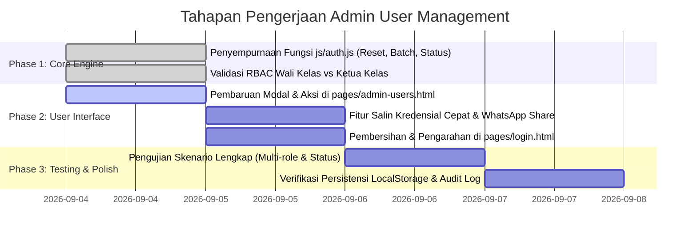

# Rencana Implementasi: Manajemen Pengguna & Akun Anggota Terpusat (Admin-Only User Management)

Dokumen ini merupakan cetak biru (*implementation blueprint*) arsitektur dan fungsionalitas sistem **Manajemen Akun Pengguna Terpusat** untuk portal kelas **X RPL 1 (WebCaprice 26)**. 

Berdasarkan kebijakan privasi dan keamanan internal kelas, sistem menerapkan model **Closed Registration (Registrasi Tertutup)** di mana pembuatan, penetapan peran, pengaturan status, dan reset kredensial akun siswa dikelola secara eksklusif oleh **Admin (Ketua Kelas)** dan **Super Admin (Wali Kelas)**.

---

## 1. Latar Belakang & Kebijakan Akses (Closed Registration Policy)

### 1.1 Prinsip Desain
1. **Pendaftaran Tertutup (*Zero Self-Registration*)**:
   - Publik atau pengunjung luar tidak dapat mendaftar mandiri melalui form pendaftaran terbuka.
   - Form pendaftaran publik dinonaktifkan sepenuhnya di [pages/login.html](file:///home/leovano/CodeProject/WEB-XRPL1/pages/login.html).
2. **Kredensial Resmi Berbasis NISN**:
   - Identitas akun menggunakan nomor induk resmi (NISN) atau email resmi kelas (`nama@caprice26.id`).
   - Password awal di-*generate* oleh admin dengan opsi generator otomatis yang aman.
3. **Pemisahan Wewenang Berjenjang (*Multi-Tier RBAC*)**:
   - **Wali Kelas (Super Admin)**: Memiliki wewenang mutlak (tambah/edit/hapus semua akun termasuk akun pengurus kelas, reset password semua tingkatan, dan kelola matriks izin).
   - **Ketua Kelas (Admin)**: Mengelola akun anggota biasa (tambah siswa baru, atur role siswa menjadi Bendahara/Sekretaris/Anggota, reset password siswa, nonaktifkan/kunci akun siswa), namun **tidak dapat** memodifikasi akun Wali Kelas ataupun mengangkat dirinya sendiri menjadi Super Admin.
   - **Bendahara & Sekretaris (Staff)**: Memiliki hak baca (*view-only*) data profil anggota untuk keperluan administrasi kas dan absensi.
   - **Anggota / Siswa (Viewer)**: Hanya dapat mengakses dashboard anggota dan mengubah profil/password pribadi setelah login pertama kali.

---

## 2. Alur Pengelolaan Akun (Sequence Diagrams)

### 2.1 Alur Pembuatan Akun Baru oleh Admin


### 2.2 Alur Login Pertama & Kebijakan Ganti Password


### 2.3 Alur Reset Password oleh Admin


---

## 3. Matriks Hak Akses & Pembagian Wewenang (RBAC)

Berikut rincian wewenang operasi akun berdasarkan perannya:

| Operasi / Hak Akses | Super Admin (Wali Kelas) | Ketua Kelas (Admin) | Bendahara & Sekretaris | Anggota (Siswa) |
| :--- | :---: | :---: | :---: | :---: |
| **Melihat Daftar Siswa (`user.view`)** | ✅ Ya | ✅ Ya | ✅ Ya (Read-only) | ❌ Tidak |
| **Tambah Siswa Baru (`user.create`)** | ✅ Ya | ✅ Ya | ❌ Tidak | ❌ Tidak |
| **Import Massal CSV/JSON (`user.bulk_import`)** | ✅ Ya | ✅ Ya | ❌ Tidak | ❌ Tidak |
| **Edit Data Siswa (`user.edit`)** | ✅ Semua Akun | ✅ Khusus Siswa & Staff | ❌ Tidak | ❌ Tidak |
| **Ubah Status (Aktif/Kunci) (`user.status_toggle`)** | ✅ Ya | ✅ Khusus Siswa & Staff | ❌ Tidak | ❌ Tidak |
| **Ubah Role Pengguna (`user.change_role`)** | ✅ Semua Role | ✅ Khusus Siswa & Staff* | ❌ Tidak | ❌ Tidak |
| **Reset Password Siswa (`user.reset_password`)** | ✅ Semua Akun | ✅ Khusus Siswa & Staff | ❌ Tidak | ❌ Tidak |
| **Hapus Akun Pengguna (`user.delete`)** | ✅ Ya | ❌ Tidak (Proteksi Wali) | ❌ Tidak | ❌ Tidak |
| **Unduh Rekap Akun / Export (`user.export`)** | ✅ Ya | ✅ Ya | ❌ Tidak | ❌ Tidak |

> [!NOTE]
> *\*Ketua Kelas dilarang memodifikasi role akun Wali Kelas (Super Admin) ataupun mempromosikan akun lain menjadi Super Admin.*

---

## 4. Skema Data & Model Penyimpanan

Data pengguna disimpan pada `localStorage` (kunci: `caprice_users_v2`) dengan integrasi kesiapan API Backend (`/api/users`).

### 4.1 Entitas Pengguna (`User`)
```typescript
interface CapriceUser {
  id: string;                 // Format: "u-" + timestamp/nanoid, misal: "u-l98xyz12"
  identifier: string;         // Email resmi atau username, misal: "budi@caprice26.id"
  nisn: string;               // Nomor Induk Siswa Nasional (10 digit angka unik)
  password: string;           // Hash bcrypt pada backend / string terlindungi pada client mock
  displayName: string;        // Nama lengkap siswa
  role: 'super-admin' | 'ketua-kelas' | 'bendahara' | 'sekretaris' | 'anggota';
  status: 'active' | 'inactive' | 'locked';
  mustChangePassword?: boolean; // Flag penanda wajib ganti password saat login pertama
  avatarUrl?: string;         // Opsional foto profil
  gender?: 'L' | 'P';         // Jenis kelamin untuk buku induk kelas
  phone?: string;             // Nomor WhatsApp untuk verifikasi & kirim kredensial
  joinedAt: string;           // Tanggal masuk format YYYY-MM-DD
  createdBy?: string;         // Identifier admin pembuat
  lastLoginAt?: string;       // Timestamp login terakhir
  updatedAt?: string;         // Timestamp modifikasi terakhir
}
```

### 4.2 Siklus Status Akun (`Status Lifecycle`)
- **`active`**: Siswa memiliki hak penuh untuk masuk dan mengakses portal sesuai role.
- **`inactive`**: Akun baru belum diaktivasi, atau siswa pindah sekolah/lulus. Akses login ditolak dengan notifikasi khusus.
- **`locked`**: Akun dibekukan sementara karena pelanggaran etika digital kelas atau pengamanan akun mencurigakan.

---

## 5. Rencana Modifikasi & Antarmuka Komponen (UI/UX)

### 5.1 Halaman Manajemen Pengguna ([`pages/admin-users.html`](file:///home/leovano/CodeProject/WEB-XRPL1/pages/admin-users.html))
Peningkatan fitur pada tabel dan modal:
1. **Fitur Tambah Siswa Baru (Modal `modal-add-user`)**:
   - Field: Nama Lengkap, NISN, Email, Role Awal, Status, dan Password Awal.
   - Tombol **"🎲 Acak Password"** untuk menghasilkan password sementara yang kuat (`Caprice-XXXX`).
   - Checkbox **"Wajib ganti password pada login pertama"** (Default: *Checked*).
2. **Modal Salin Kredensial (*Credential Card Sharing*)**:
   - Menampilkan ringkasan kredensial yang baru dibuat atau direset:
     ```text
     🎓 Portal Kelas X RPL 1 (Caprice 26)
     Nama      : [Nama Siswa]
     NISN      : [NISN]
     Username  : [Email/Username]
     Password  : [Password Sementara]
     Tautan    : https://caprice26.id/pages/login.html
     *Harap segera login dan perbarui password Anda.
     ```
   - Tombol satu klik: **"📋 Salin ke Clipboard"** & **"💬 Kirim via WhatsApp"**.
3. **Aksi Cepat per Baris Pengguna (Action Column)**:
   - 🛡️ **Atur Role**: Mengubah penugasan peran (Ketua Kelas, Bendahara, Sekretaris, Anggota).
   - 🔑 **Reset Password**: Membuka dialog reset cepat tanpa perlu menghapus akun.
   - 🔄 **Toggle Status**: Mengubah status Aktif / Kunci / Nonaktif dengan 1 klik.
   - 🗑️ **Hapus Akun**: Hanya aktif untuk Super Admin dengan konfirmasi nama pengguna.
4. **Fitur Impor & Ekspor Massal (*Batch Management*)**:
   - Tombol **"📥 Impor Siswa (CSV/JSON)"** untuk menambahkan seluruh siswa satu kelas sekaligus.
   - Tombol **"📤 Ekspor Data Siswa"** untuk rekap absensi dan buku induk kelas.

### 5.2 Halaman Login ([`pages/login.html`](file:///home/leovano/CodeProject/WEB-XRPL1/pages/login.html))
1. Menghilangkan opsi registrasi mandiri publik.
2. Memperjelas banner informasi:
   > *"Akun anggota resmi diterbitkan dan dikelola oleh Administrator / Pengurus Kelas X RPL 1. Belum memiliki akun atau lupa password? Hubungi Ketua Kelas atau Wali Kelas."*
3. Form login mendukung input fleksibel: bisa menggunakan **NISN** ataupun **Email/Username**.

### 5.3 Modul Engine Autentikasi ([`js/auth.js`](file:///home/leovano/CodeProject/WEB-XRPL1/js/auth.js))
Menambahkan fungsi-fungsi spesifik penunjang manajemen admin:
- `CapriceAuth.resetUserPassword(userId, newPassword, actorUser)`: Mengubah password akun target, menyetel `mustChangePassword = true`, dan mencatat event audit `USER_PASSWORD_RESET`.
- `CapriceAuth.toggleUserStatus(userId, newStatus, actorUser)`: Mengubah status akun (`active`, `inactive`, `locked`) dengan validasi hak akses actor.
- `CapriceAuth.importUsersBatch(userList, actorUser)`: Memvalidasi dan menyimpan daftar siswa secara kolektif dengan audit trail.
- `CapriceAuth.exportUsersData()`: Menghasilkan format JSON / CSV dari data akun kelas aktif.

---

## 6. Integrasi Log Audit Keamanan ([`pages/admin-audit-logs.html`](file:///home/leovano/CodeProject/WEB-XRPL1/pages/admin-audit-logs.html))

Setiap aksi administratif dicatat ke dalam audit trail dengan struktur:
- **`USER_CREATE`**: Dicatat saat admin menambahkan akun siswa baru.
- **`USER_UPDATE`**: Dicatat saat informasi profil atau identitas siswa diperbarui.
- **`ROLE_CHANGE`**: Dicatat saat role siswa diubah (contoh: Anggota dipromosikan jadi Bendahara).
- **`USER_STATUS_CHANGE`**: Dicatat saat akun dinonaktifkan atau dikunci.
- **`USER_PASSWORD_RESET`**: Dicatat saat admin mereset password akun tertentu.
- **`USER_DELETE`**: Dicatat saat Super Admin menghapus akun anggota.

---

## 7. Rencana Tahapan Eksekusi (Implementation Steps)



### Langkah 1: Penguatan Backend/Engine ([`js/auth.js`](file:///home/leovano/CodeProject/WEB-XRPL1/js/auth.js))
- Implementasi `resetUserPassword(userId, newPassword, actorUser)`.
- Implementasi `toggleUserStatus(userId, newStatus, actorUser)`.
- Implementasi proteksi mutlak akun `super-admin` agar tidak dapat dimanipulasi oleh role di bawahnya.

### Langkah 2: Peningkatan UI Panel Admin ([`pages/admin-users.html`](file:///home/leovano/CodeProject/WEB-XRPL1/pages/admin-users.html))
- Tambahkan modal **"Reset Password Siswa"** dengan generator password.
- Tambahkan modal dialog **"Kredensial Siswa Dibuat"** dengan tombol *Copy to Clipboard*.
- Tambahkan filter status dan tombol aksi cepat di setiap baris tabel siswa.

### Langkah 3: Penyesuaian Halaman Login ([`pages/login.html`](file:///home/leovano/CodeProject/WEB-XRPL1/pages/login.html))
- Pastikan login bisa menerima NISN maupun Email.
- Sediakan panduan bantuan resmi jika siswa lupa password untuk menghubungi pengurus kelas.

---

## 8. Skenario Pengujian & Verifikasi (Test Cases)

| No | Kasus Uji | Langkah Aksi | Hasil yang Diharapkan |
| :---: | :--- | :--- | :--- |
| **TC-01** | Tambah Siswa Baru oleh Ketua Kelas | Login sebagai `ketua@caprice26.id` -> Tambah siswa baru dengan NISN `0091234567` dan Role `Anggota`. | Akun tersimpan, muncul modal salin kredensial, dan tercatat di Audit Log. |
| **TC-02** | Proteksi Role oleh Ketua Kelas | Coba ubah akun Wali Kelas atau tetapkan role `super-admin` saat login sebagai Ketua Kelas. | Sistem menolak dengan notifikasi error izin ditolak (*Forbidden*). |
| **TC-03** | Login Akun Baru dengan NISN | Logout -> Di `login.html`, masukkan NISN baru dan password awal. | Berhasil login dan diarahkan ke `dashboard-viewer.html`. |
| **TC-04** | Reset Password oleh Admin | Login sebagai Admin -> Klik Reset Password pada salah satu siswa -> Isi password baru `siswaBaru123`. | Password lama tidak bisa digunakan lagi; siswa berhasil login dengan password baru. |
| **TC-05** | Blokir / Kunci Akun Siswa | Admin mengubah status siswa menjadi `locked`. Siswa mencoba login. | Login ditolak dengan pesan: *"Akun ini sedang dikunci sementara. Hubungi administrator."* |
| **TC-06** | Hapus Akun oleh Super Admin vs Ketua Kelas | Ketua Kelas mencoba hapus akun -> Ditolak. Wali Kelas mencoba hapus akun -> Berhasil terhapus & dicatat di Audit Log. | Hanya Wali Kelas (Super Admin) yang dapat menghapus akun secara permanen. |

---

## 9. Status Dokumen & Tindak Lanjut

Dokumen rencana ini telah disesuaikan dengan arsitektur riil direktori proyek WebCaprice 26:
- Halaman Frontend: [`pages/admin-users.html`](file:///home/leovano/CodeProject/WEB-XRPL1/pages/admin-users.html), [`pages/login.html`](file:///home/leovano/CodeProject/WEB-XRPL1/pages/login.html), [`pages/admin-roles.html`](file:///home/leovano/CodeProject/WEB-XRPL1/pages/admin-roles.html), [`pages/admin-audit-logs.html`](file:///home/leovano/CodeProject/WEB-XRPL1/pages/admin-audit-logs.html).
- Script Logika & Data: [`js/auth.js`](file:///home/leovano/CodeProject/WEB-XRPL1/js/auth.js), [`js/config.js`](file:///home/leovano/CodeProject/WEB-XRPL1/js/config.js), [`js/middleware.js`](file:///home/leovano/CodeProject/WEB-XRPL1/js/middleware.js).
